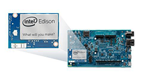

# How to go from Zero to Blinking Light Hero

_Instructions for **Intel® Edison** installed on an **Arduino-compatible expansion board** using the Intel® IoT Developer Kit **(C/C++ or JavaScript development workflow)**_

## 1. Get Started with Intel® Edison

Find out what hardware is included with your Intel® IoT Developer Kit ("dev kit"). And review important assembly and cable hook up instructions.

* [Assembly - Arduino expansion board »](/docs/assembly/arduino_expansion_board/assembly.html)
* [Connecting Cables - Arduino expansion board »](/docs/assembly/arduino_expansion_board/connecting_cables.html)

## 2. Set Up Your Computer

Install software and drivers specifically for your computer's operating system. 

* **Mac or Linux user?** 

  You have no special setup. Skip to [Step 3](#3-shell-access) below.

* **Windows user?**

  * **Do you have 64-bit Windows and a reliable internet connection?**  

      [Set Up Your Computer - Windows (64-bit integrated installer) »](/docs/computer_setup/windows/64bit_integrated_installer.html)

  * **At a hackathon with unreliable internet? Or can't click 'Next' in the 64-bit integrated installer wizard?** 

      [Set Up Your Computer - Windows (manual installation) »](/docs/computer_setup/windows/manual_installation.html)

## 3. Shell Access

Gain command line access of your IoT board. Execute special Linux commands to configure your IoT board such as setting up Wi-Fi.

* [Windows »](/docs/shell_access/windows/serial_connection.html)
* [Mac »](/docs/shell_access/mac/serial_connection.html)
* [Linux »](/docs/shell_access/linux/serial_connection.html)

## 4. Flash Edison Firmware

Some Edison boards have older firmware images on them. You **_may_** need to update the firmware to a newer version to get access to important features.

* [Flash Edison Firmware Manually »](/docs/flash_firmware/manually.html)

## 5. Get Your IoT Board Online

Get your board online in order to turn your IoT board into a true "Internet of Things" device. You also need the IP address of your IoT board to program it using the dev kit IDEs.

* **At a hackathon? On a busy or restricted Wi-Fi network?**
  
  Connect to the Intel® Edison using the device mode micro-USB cable and a virtual Ethernet connection known as "Ethernet over USB":
  
  * [Windows »](/docs/connectivity/ethernet_over_usb/windows/connect.html)
  * [Linux »](/docs/connectivity/ethernet_over_usb/linux/connect.html)
  * Note: At this time, Ethernet over USB on Mac is not officially supported.

* **At home? Have a dependable Wi-Fi connection?**

  * [Connect Your Intel Edison to Wi-Fi »](/docs/connectivity/wifi/connect.html)

## 6. Install an IDE

Based on your programming language preference, install an IDE for Intel® IoT development:

* **For JavaScript:**
  * [Set Up Intel XDK for IoT »](/docs/ide_setup/xdk/setup.html)
  * [Run a Sample Intel XDK for IoT Project »](/docs/ide_setup/xdk/create_project.html)

* **For C/C++:**
  * [Set Up IoT Dev Kit Eclipse »](/docs/ide_setup/eclipse/setup.html)
  * [Run a Sample Eclipse Project »](/docs/ide_setup/eclipse/create_project.html)

## 7. Sensor Tutorials

Experiment with sample code supplied for available sensors and actuators.

* **[Grove Starter Kit - Intro »](/docs/sensor_examples/grove_starter_kit/)**
  * [JavaScript »](/docs/sensor_examples/grove_starter_kit/javascript/samples.html)
  * [C++ »](/docs/sensor_examples/grove_starter_kit/c/samples.html)

Also search for your component on [software.intel.com/en-us/iot/sensors](http://software.intel.com/en-us/iot/sensors).

## Now make your own creation!

Take pictures along the way. Create your own guide and
post them to [Instructables.com](http://instructables.com/id/intel).

## Running into issues?

Search for answers and post your questions to the [Intel® Edison Support Community](https://communities.intel.com/community/tech/edison).

## Resources

* [Intel® Edison Product Brief](http://www.intel.com/support/edison/sb/CS-035277.htm) (Specs)
* [Intel® Edison Arduino Expansion Board Hardware Guide](http://www.intel.com/support/edison/sb/CS-035275.htm) - For pinout listing, see page 7
* [Intel® Edison Mini Breakout Board Hardware Guide](http://www.intel.com/support/edison/sb/CS-035252.htm) - For pinout listing, see page 9 
* [Yocto Project: Foundation for the Internet of Things](https://www.youtube.com/watch?v=ztsnQ3p59jA&list=PLg-UKERBljNw254jnyMNZiu8yqF8pPq0m&index=24) (Introduction to Yocto video)
* [Intel® IoT Developer Kit Cloud-based Analytics User Guide](https://software.intel.com/en-us/intel-iot-developer-kit-cloud-based-analytics-user-guide) 
* [Seeed Studio Sketchbook Starter Kit](https://github.com/Seeed-Studio/Sketchbook_Starter_Kit_V2.0) (Sensor sample code for Arduino IDE)
