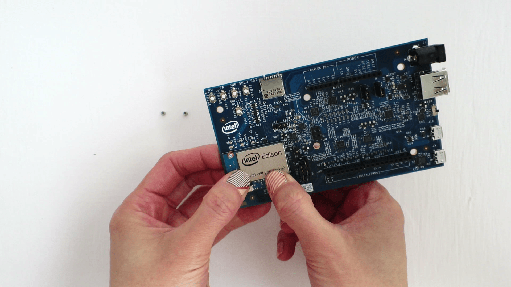

1. Locate the Intel® Edison compute module, Arduino expansion board, and two metal hex nuts.

    

2. Place the Intel® Edison compute module within the white outline on the Arduino expansion board, lining up the holes on the Intel® Edison compute module with the screws on the expansion board.

    

3. Press down on the Intel® Edison compute module just below the words "What will you make?" until you feel a *snap*.

    

    **Make sure the compute module is seated properly.** If you do *not* feel a snap, a loosely connected Intel® Edison will produce unexpected behaviors.

4. Use the two hex nuts to secure the module to the expansion board. Hand tighten the hex nuts onto the two screws that protrude through the board.

    

**Done!** 
Your Arduino expansion board should look like the photo below when the Intel® Edison compute module is installed.

