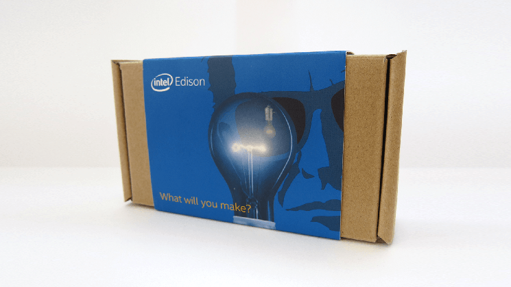
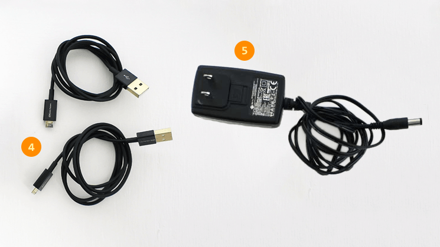
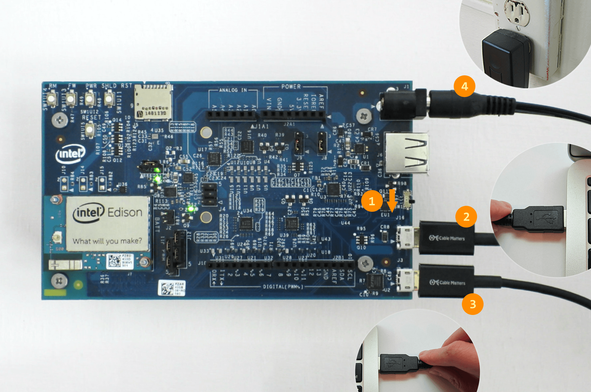
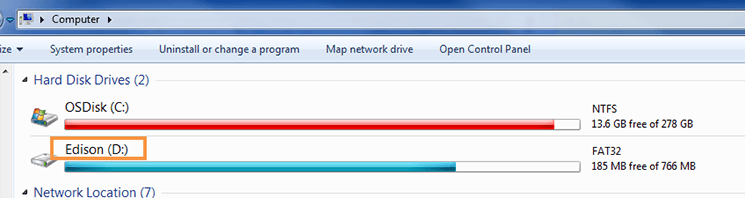

* [Inside the Intel® Edison Kit for Arduino box »](#inside-the-intel-edison-kit-for-arduino-box)
* [Additional cables required »](#additional-cables-required)
* [Assembling the Intel® Edison Kit for Arduino »](#assembling-the-intel-edison-kit-for-arduino)
  * [Install the Intel® Edison compute module »](#install-the-intel-edison-compute-module)
  * [Install the plastic spacers »](#install-the-plastic-spacers)
* [Connect the Intel® Edison to your computer for development »](#connect-the-intel-edison-to-your-computer-for-development)
  * [LED indicator](#led-indicator)

# Unboxing and Assembly

Find out what is in your Intel® Edison Kit for Arduino box. Some assembly is required.

## Inside the Intel® Edison Kit for Arduino box

<dl>

  <dt>(1) Intel® Edison compute module</dt>
  <dd>Refer to the <a href="http://www.intel.com/support/edison/sb/CS-035277.htm">Intel® Edison product brief</a> for specs.</dd>

  <dt>(2) Arduino expansion board</dt>
  <dd>Hardware pin-compatible with Arduino Uno R3 shields. Refer to the <a href="http://www.intel.com/support/edison/sb/CS-035275.htm">Intel® Edison Kit for Arduino hardware guide</a> for specs.</dd>

  <dt>(3) Assembly hardware</dt>
  <dd>
    <ul>
      <li><strong>Small hex nuts (x2)</strong> - For securing the Intel® Edison compute module to the expansion board.</li>
      <li><strong>Screws (x4) &amp; plastic spacers (x4)</strong> - To keep the expansion board stable and lifted off of surfaces that may cause a short circuit.</li>
    </ul>
  </dd>

</dl>

## Additional cables required

<dl>

  <dt>(4) Micro-B USB to Standard-B USB cables (x2)</dt>
  <dd>These common micro-USB cables are used for charging mobile phones and other consumer electronics.</dd>

  <dt>(5) Direct current (DC) power supply rated as follows:</dt>
  <dd>
    <ul>
      <li>7-15V DC</li>
      <li>At least 1500mA</li>
      <li>Center/inner pin is positive pole</li>
    </ul>
  </dd>

</dl>

  **Do not have an external power supply?**

  An external power supply is the most stable and reliable way of powering the Intel® Edison board.

  However, you can power your board using the device mode USB cable if you do not have an external power supply. Refer to the <a href="#connect-the-intel-edison-to-your-computer-for-development">Connect the Intel® Edison to your computer for development</a> section later on this page for more details.

  The recommended EMSA120150 power supply can be purchased from <a href="http://www.digikey.com/product-detail/en/EMSA120150-P5P-SZ/T1091-P5P-ND/2352085" rel="nofollow" target="_blank">digikey.com</a> or <a href="http://www.futureelectronics.com/en/Technologies/Franchised/Product.aspx?ProductID=EMSA120150-045P5RP-045SZCUI&IM=0" rel="nofollow" target="_blank">futureelectronics.com</a>.

## Assembling the Intel® Edison Kit for Arduino

### Install the Intel® Edison compute module

The Intel® Edison compute module is meant to be used with breakout boards or custom PCBs. You will need to secure the compute module to the Arduino expansion board before you can use it. 

[{: .animated data-still="images/module_install-firstframe.jpg" data-animated="images/module_install-animated.gif"}](details-install_module.html)

[View detailed instructions on installing the module »](details-install_module.html){: .link-button .centered}

### Install the plastic spacers

To add stability to the expansion board and to help avoid accidental short circuits, attach the four plastic spacers supplied in your Intel® Edison box to act as "legs" for the expansion board. 

[{: .animated data-still="images/spacer_install-firstframe.jpg" data-animated="images/spacer_install-animated.gif"}](details-install_spacers.html)

[View detailed instructions on installing the spacers »](details-install_spacers.html){: .link-button .centered}

## Connect the Intel® Edison to your computer for development

While plugging in every cable is not required all the time, a cable setup for initial development purposes would look like the photo below:

**(1)** Microswitch set to **[USB device mode](index-connecting_cables.html#device-mode-vs-host-mode)** (i.e. toggled ***down*** towards the micro-USB ports).

**(2)** **[Device mode cable](index-connecting_cables.html#device-mode-micro-usb-cable)** (i.e. ***top*** micro-USB port) plugged into your computer for 5V power, programming the Intel® Edison using the Arduino IDE, writing to the onboard flash memory from your computer, and/or using Ethernet over USB.

**(3)** **[UART/serial cable](index-connecting_cables.html#uartserial-micro-usb-cable)** (i.e. ***bottom*** micro-USB port) plugged into your computer for shell access via serial communication.

**(4)** Connected to a **[DC power supply](index-connecting_cables.html#dc-power-supply)** for stable and reliable power &mdash; *optional but **highly recommended***

### LED indicator

A green LED (labeled **DS1** on the Arduino expansion board) should light up when the **device mode (2)** and/or **DC power supply (4)** cables are connected.

  <!-- **Troubleshooting** -->
  **The green LED does not light up**  
  Check your power supply and/or device mode cable connections.

  **The green LED is turning on and off**  
  If you are using only the device mode micro-USB cable for power, your computer's USB port is not reliably supplying power to the board. Use an external DC power supply or a powered USB hub.

  ---

  One sign that your board is fully initialized is when your computer mounts a new drive named "Edison", much like inserting a SD card into your computer.

  

You should now have the Intel® Edison compute module installed, all the development cables connected, and the Intel® Edison powered on.

[Continue to the next step in the START HERE guide »](../../index.html#done-assembly){: .link-button .centered}

* The Arduino name, logo and the graphics design of its boards are a protected trademark of Arduino and its partners.

