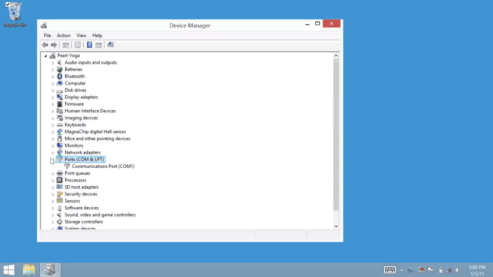
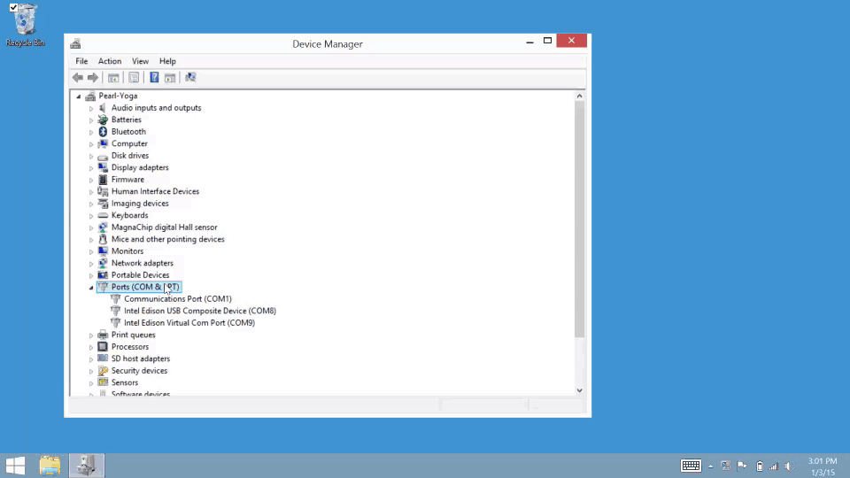

# Confirm driver installation - Windows 

* [Open Windows Device Manager »](#open-windows-device-manager)
* [Confirm installation of Intel® Edison Drivers »](#confirm-installation-of-intel-edison-drivers)
* [Confirm installation of FTDI serial drivers »](#confirm-installation-of-ftdi-serial-drivers)

<!-- 

* [Intel Edison: Set Up Your Computer Manually - Windows (preview video)](https://drive.google.com/open?id=0B6gHgawzKtxCbUxicmpBc2JZSmM&authuser=0)
* [Intel Edison: Set Up Your Computer - Windows Integrated Installer (preview video)](https://drive.google.com/open?id=0B6gHgawzKtxCejNuYjc3a216X3M&authuser=0)

 -->

## Open Windows Device Manager

Launch the Device Manager utility on Windows in order to debug your Intel® IoT board USB connections. 

[View detailed instructions »](details-open_device_manager.html)

## Confirm installation of Intel® Edison Drivers

Look for both "Intel Edison USB Composite Device" and "Intel Edison Virtual Com Port" items in Device Manager under “Ports (COM & LPT)” after plugging in the device mode USB cable. 

[View detailed instructions »](details-confirm_edison_drivers.html)

## Confirm installation of FTDI serial drivers

Look for "USB Serial Port" in Device Manager under “Ports (COM & LPT)” after plugging in the UART/serial USB cable. 

[View detailed instructions »](details-confirm_ftdi_cdm_drivers.html)

### Next Steps

Some Edison boards have older firmware images on them. You **_may_** need to update the firmware to a newer version to get access to important features.

* [Install Edison Flash Tool »](../../flash_firmware/windows_install.html)

