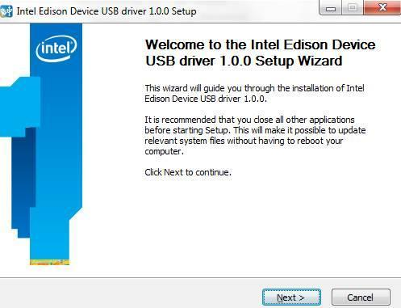

1. Get the latest Intel® Edison Device USB drivers for Windows installer.

    

    1. On the USB key: downloads → Windows
    2. Copy IntelEdisonDriverSetup[version].exe to your computer.
    

2. Double-click on the IntelEdisonDriverSetup[version].exe on your computer to begin installation. 

    

3. Follow the installation wizard. Click **Next** where needed. The default settings can be adjusted to your needs if required but you may wish to leave the defaults as is. 

4. Click **Finish** to close the installation wizard.
