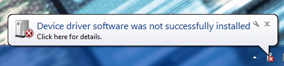
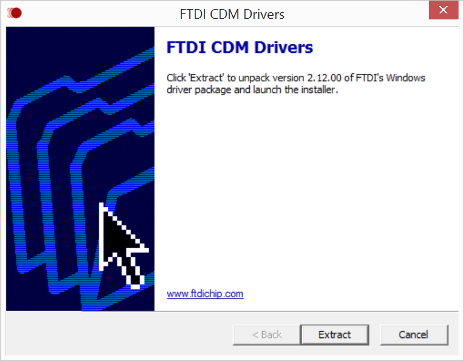

## Install FTDI serial drivers

FTDI CDM drivers allow your computer to communicate with USB serial devices, including the Intel® Edison.

**Do you already have FTDI CDM drivers installed?**

If you have done Arduino development on your current computer before, you may already have the FTDI CDM drivers installed. Refer to [Confirm installation of FTDI serial drivers](confirm_drivers.html#confirm-installation-of-ftdi-serial-drivers) to see if you need to skip over this step.

However, if you see a "New Hardware Found" message when you plug in the Intel® Edison via the UART/serial micro-USB port and the automatic device driver installation fails, you will need to install the FTDI drivers. Ignore Windows' request to install the drivers for you and follow the steps below. 

 
1. Get the latest FTDI CDM driver installer.

    

    1. On the USB key: **downloads → Windows**
    2. Copy **CDM [version] WHQL Certified.exe** to your computer.
    

2. Right-click on **CDM [version] WHQL Certified.exe**. Select "**Run as administrator**".

    

3. Click "**Extract**" to start the installation process. 
  
    

4. Follow the installation wizard prompts. Click "**Next**" where needed.

5. Click "**Finish**" to close the installation wizard.
