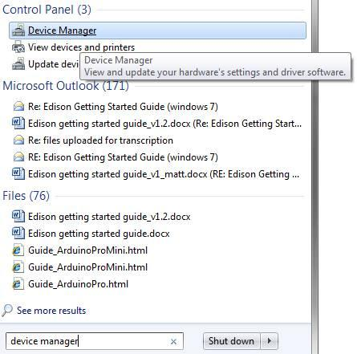
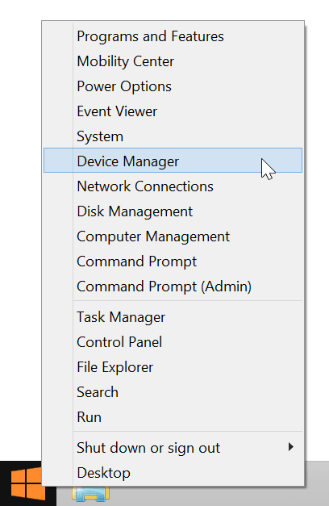
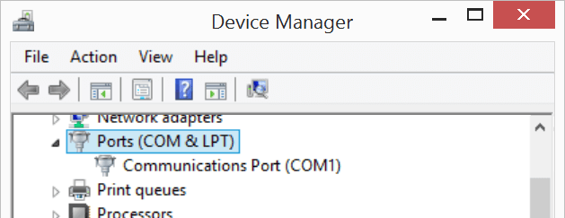

1. Launch Device Manager.

    

      

      **Windows 7 and below:**

      1. Open Start menu.
      2. Start typing "device manager" in the search field. 
      3. Select "Device Manager" under "Control Panel"

      
      

      

      **Windows 8:**
      
      1. Go into Windows Desktop mode.
      2. Right-click on the Start menu button.
      3. Select "Device Manager".

      
      

    

2. In Device Manager, locate and toggle open "**Ports (COM & LPT)**".

    
