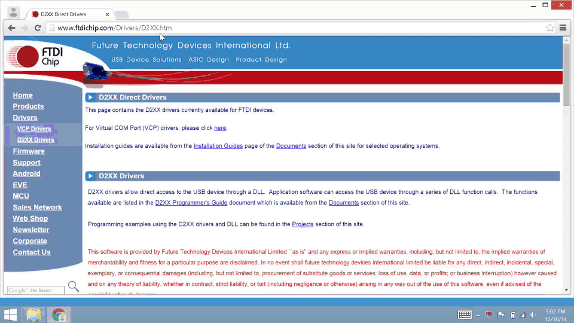

# Set Up Your Computer - Windows (manual installation)

This setup document will guide you through manually preparing your Windows 32-bit or 64-bit computer with any Windows-specific software or drivers required for Intel® Edison development. 

* [Install Intel® Edison standalone drivers »](#install-intel-edison-standalone-drivers)
* [Install FTDI serial drivers »](#install-ftdi-serial-drivers)
* [Restart your computer »](#restart-your-computer)

<!-- 

  <iframe src="https://drive.google.com/file/d/0B6gHgawzKtxCbUxicmpBc2JZSmM/preview" width="565" height="367"></iframe>

 -->

## Install Intel® Edison standalone drivers

The Windows standalone drivers for Intel® Edison include several USB drivers in one installer package. These drivers enable important features, such as:

* Composite Device Class (CDC) for programming the board via the Arduino IDE,
* Remote Network Driver Interface Spec (RNDIS) for Ethernet over USB, and
* Device Firmware Upgrade (DFU) for updating firmware on devices.

[View detailed instructions »](details-install_edison_drivers.html)

## Install FTDI serial drivers

FTDI CDM drivers allow your computer to communicate with USB serial devices, including the Intel® Edison. 

[View detailed instructions »](details-install_ftdi_cdm_drivers.html)

## Restart your computer

To ensure driver installation changes take effect, reboot your Windows computer at this point.

### Next Steps

[Confirm driver installation »](confirm_drivers.html)

