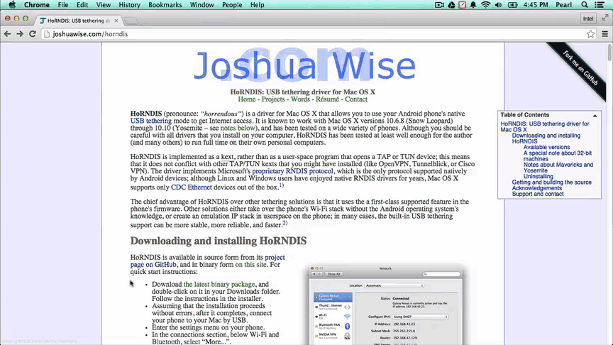
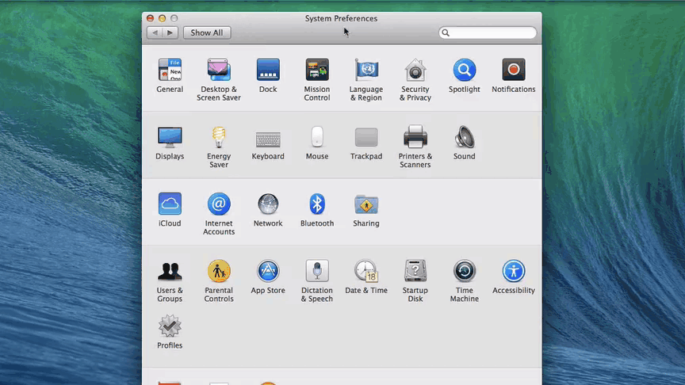

* [Install HoRNDIS »](#install-horndis)
* [Configure network settings »](#configure-network-settings)
* [Share your computer's WiFi connection (optional) »](#share-your-computers-wifi-connection-optional)

# Set Up Ethernet over USB - Mac

When you are in a busy or restricted network environment, connect to the Intel® Edison using the device mode micro-USB cable and a virtual Ethernet connection known as "Ethernet over USB". Ethernet over USB uses the RNDIS protocol.

This document will guide you through obtaining an IP address for the Intel® Edison in order to program your board offline using the Intel® IoT Developer Kit IDEs.

**IMPORTANT NOTE: At this time, Ethernet over USB on Mac is not officially supported.**

HoRNDIS has been found to crash some computers running Mac OS. Please proceed with caution and only attempt to use Ethernet over USB if you are unable to use Wi-Fi.

If you have access to a Wi-Fi network, instead follow [Connect Your Intel Edison to Wi-Fi »](../.../wifi/connect.html)

<!-- 

[Ethernet over USB - Intel Edison - Mac (preview)](https://drive.google.com/open?id=0B2ywC78pxngCSlJtbTNmNGhVVEU&authuser=0)

 -->

## Install HoRNDIS

Install the HoRNDIS (pronounced "horrendous") kernel extension to use Ethernet over USB via the RNDIS protocol on your Mac. You must reboot your computer after installing HoRNDIS. 

[View detailed instructions »](details-install_horndis.html)

## Configure network settings

Update your computer's Network configuration with a static IP address to use Ethernet over USB. 

[View detailed instructions »](details-configure_mac_network.html)

## Share your computer's WiFi connection (optional)

Turn on Internet Sharing to cut down on Wi-Fi traffic in a crowded room. Sharing your computer's internet connection also means that you can log into networks that have HTML password pages and then share the connection with the Intel® Edison. Internet sharing is an optional step but is highly recommended if you are at a hackathon. 

[View detailed instructions »](details-share_internet.html)

 

**Additional Resources**

See what you can do [once connected »](../shared/once_connected.html)

### Next Steps

Based on your programming language preference, install an IDE for Intel® IoT development:

* For C/C++: [Set Up IoT Dev Kit Eclipse »](../../../ide_setup/eclipse/setup.html)
* For JavaScript: [Set Up Intel XDK for IoT »](../../../ide_setup/xdk/setup.html)
* For Arduino: [Set Up Arduino IDE »](../../../ide_setup/arduino/setup.html)

