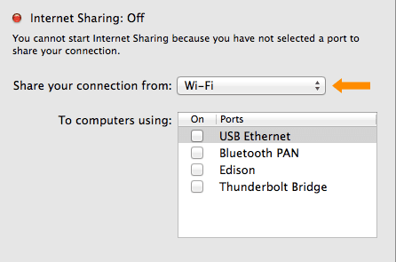
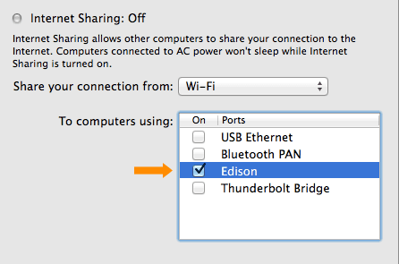

1. Open your **Sharing** preference settings.
  (i.e. In the OS X menu bar, choose  → System Preferences → Sharing)

2. If "**Internet Sharing**" is currently checked in the lefthand services list, **uncheck it** in order to make changes to your Mac Sharing settings.

    

3. Select "**Wi-Fi**" from the "**Share your connection from**" dropdown list, if not already selected.

    

4. Check "**Edison**" under "**To computers using**".

    

5. Enable sharing by checking "**Internet Sharing**" in the lefthand services list.

6. You will see a warning. Click "**Start**" to continue.

    

7. Unplug and replug the device mode micro-USB cable to reset the Ethernet over USB connection.

8. Use Terminal to establish a serial connection to the Intel® Edison. 

9. On your Intel® Edison, disconnect from any WiFi networks the board might be logged into using the wireless command line interface (`wpa_cli`) command:

    ```
    wpa_cli disconnect
    ```

10. Then use the `route` command to add a default gateway. Use the same static IP address you set in the **Network** settings in the previous section.

    ```
    route add default gw 192.168.2.2
    ```

<div class="callout done" markdown="1">
You can now use the Intel® Edison as if it is connected to the internet on its own as long as you keep the device mode micro-USB cable plugged in.

Try pinging a network from Terminal to make sure the Intel® Edison is connected to the internet through your computer's network connection:

```
ping google.com
```

(Use the Ctrl+C keyboard command to exit the ping process.)

To re-enable WiFi on the Intel® Edison, use the `configure_edison --wifi` command as described in [Connect Your Intel Edison to Wi-Fi](../../wifi/connect.html).
</div>

<div class="callout troubleshooting" markdown="1">
**Unable to ping anything from the Intel® Edison?**

* Unplug and replug the device mode micro-USB cable to reset the Ethernet over USB connection.
* Turn your computer's WiFi connections off, then back on.
* Restart your computer.
* Check that the IP address set in the IPv4 LAN settings is "192.168.2.2"
</div>
