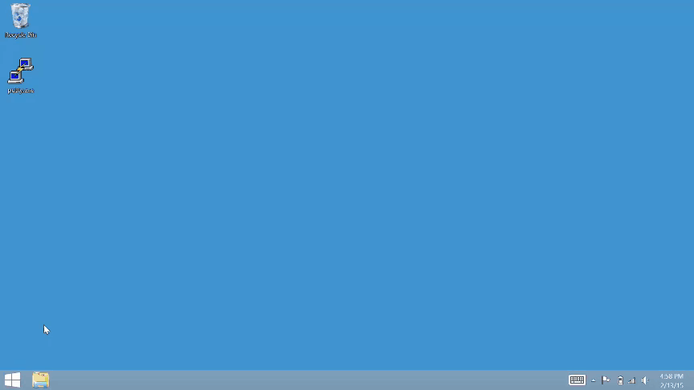

## Set Up Ethernet over USB - Windows

When you are in a busy or restricted network environment, connect to the Intel® Edison using the device mode micro-USB cable and a virtual Ethernet connection known as "Ethernet over USB". Ethernet over USB uses the RNDIS protocol.

This document will guide you through obtaining an IP address for the Intel® Edison in order to program your board offline using the Intel® IoT Developer Kit IDEs.

* [Add static IPv4 address »](#add-static-ipv4-address)
* [Share your computer's WiFi connection (optional) »](#share-your-computers-wifi-connection-optional)

<!-- 

[Ethernet over USB - Intel Edison - Windows (preview)](https://drive.google.com/open?id=0B2ywC78pxngCUWJxZXJiYngycU0&authuser=0)

 -->

## Add static IPv4 address

If you have the Intel® Edison Drivers installed, update your computer's Network Adapter configuration with a static IP address to use Ethernet over USB. 

[View detailed instructions »](details-ipv4_address.html)

## Share your computer's WiFi connection (optional)

Turn on Internet Connection Sharing (ICS) to cut down on Wi-Fi traffic in a crowded room. Sharing your computer's internet connection also means that you can log into networks that have HTML password pages and then share the connection with the Intel® Edison. Internet sharing is an optional step but is highly recommended if you are at a hackathon. 

[View detailed instructions »](details-share_internet.html)

 

**Additional Resources**

See what you can do [once connected »](/docs/connectivity/ethernet_over_usb/shared/once_connected.html)

### Next Steps

Based on your programming language preference, install an IDE for Intel® IoT development:

* For C/C++: [Set Up IoT Dev Kit Eclipse »](/docs/ide_setup/eclipse/setup.html)
* For JavaScript: [Set Up Intel XDK for IoT »](/docs/ide_setup/xdk/setup.html)
* For Arduino: [Set Up Arduino IDE »](/docs/ide_setup/arduino/setup.html)

