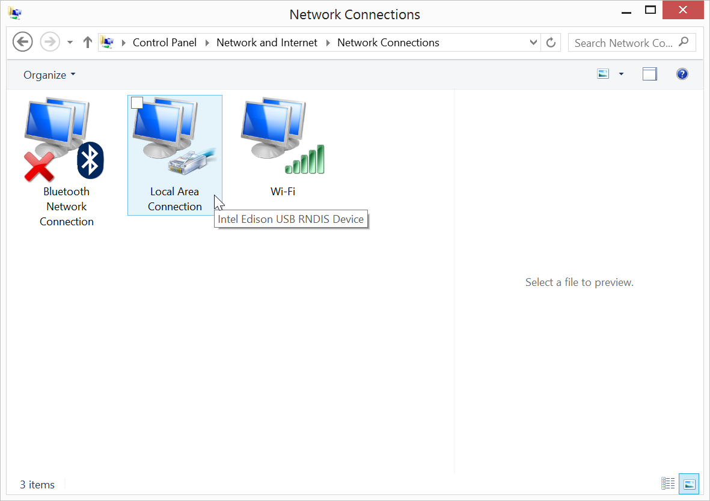

**Have you installed the Intel® Edison Drivers?**

If you have not followed [Set Up Your Computer - Windows (manual installation)](../../../computer_setup/windows/manual_installation.html), please do so now. RNDIS drivers are included with the Intel® Edison Drivers.

1. View your **Network Connections**.
    
    

      

      **Windows 8**: 

      1. Right-click on the Start menu button.

      2. Select "**Network Connections**".
      

      

      **Windows 7 and below**: 

      1. Go to the Windows Control Panel. 

      2. Under "**Network and Internet**", click "**View network status and tasks**".
          

      3. Click "**Change Adapter Settings**" in sidebar.
          
      

    

2. Make sure your IoT board has the microswitch set to **device mode** and plug in the **device mode micro-USB cable** from your Intel® Edison to your computer. 

    Wait one minute for the Intel® Edison to finish booting up.

    

    _Refer to [Device mode micro-USB cable](../../../assembly/arduino_expansion_board/details-device_mode_cable.html) for full assembly instructions._

3. **Right-click** on the "**Local Area Connection**" network adapter entry with the label "**Intel Edison USB RNDIS Device**", then select "**Properties**".

    

      

      
      

      

      
      

    

4. In the new "Local Area Connection Properties" window, select "**Internet Protocol Version 4 (TCP/IPv4)**" from the list, then click "**Properties**".

    

5. In the new dialog window, select "**Use the following IP address**" and change the IP information as follows:

    * **IP address**: 192.168.2.2

    * **Subnet m****ask**: 255.255.255.0 (default)

    

6. Click "OK" to apply your changes and close the IPv4 properties window. 

    

    **IP address taken?**

    If you get a system notification that 192.168.2.2 is taken, try any IP address within the ranges of 192.168.2.1 to 192.168.2.14. 

    Do ***not*** use 192.168.2.15 which is already reserved for the USB Gadget network interface.
    

7. Click "Close" in any remaining network dialog windows that are open.

There is no noticeable difference to the "Local Area Connection" adapter icon. See [Once connected...](../shared/once_connected.html) to confirm a successful connection to the Intel® Edison.

