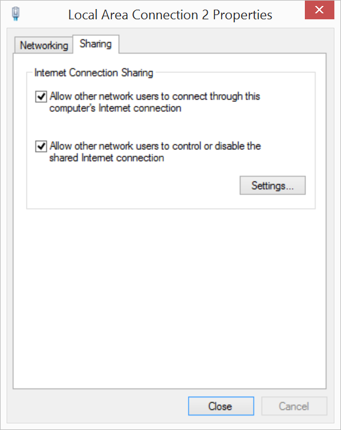

1. Open your **Network Connections** again.

2. **Right-click** on the "**Wi-Fi**" network adapter entry, then select "**Properties**".

    

3. Select the "**Sharing**" tab. 

4. Check "**Allow other network users to connect through this computer’s Internet connection**" to enable Internet Connection Sharing (ICS).

    

5. Click "**Ok**". 

6. You will receive an alert about enabling ICS. Click "**Yes**" to continue.

    

    <div class="callout warning" markdown="1">
    Enabling ICS may have changed the IPv4 LAN settings you set in the previous section. Follow the steps in [Add static IPv4 address](#add-static-ipv4-address) to confirm that "Use the following IP address" is still set to "192.168.2.2".
    </div>

7. Unplug and replug the device mode micro-USB cable to reset the Ethernet over USB connection.

8. Use PuTTY to establish a serial connection to the Intel® Edison. 
  
9. On your Intel® Edison, disconnect from any WiFi networks the board might be logged into using the wireless command line interface (`wpa_cli`) command:

    ```
    wpa_cli disconnect
    ```

10. Then use the `route` command to add a default gateway. Use the same static IPv4 address you set in the **Network Connections** LAN settings in the previous section.

    ```
    route add default gw 192.168.2.2
    ```
  
<div class="callout done" markdown="1">
You can now use the Intel® Edison as if it is connected to the internet on its own as long as you keep the device mode micro-USB cable plugged in.

Try pinging a network from PuTTY to make sure the Intel® Edison is connected to the internet through your computer's network connection:

```
ping google.com
```

(Use the Ctrl+C keyboard command to exit the ping process.)

To re-enable WiFi on the Intel® Edison, use the `configure_edison --wifi` command as described in [Connect Your Intel Edison to Wi-Fi](../../wifi/index.html).
</div>

<div class="callout troubleshooting" markdown="1">
**Unable to ping anything from the Intel® Edison?**

* Unplug and replug the device mode micro-USB cable to reset the Ethernet over USB connection.
* Turn your computer's WiFi connections off, then back on.
* Restart your computer.
* Check that the IP address set in the IPv4 LAN settings is "192.168.2.2"
</div>