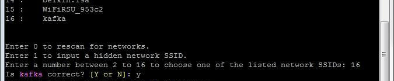
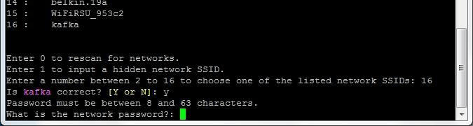

1. Establish a serial connection to the Intel® Edison. 

2. Use the `configure_edison` command with the `--wifi` flag to start the wifi configuration process.

    ```
    configure_edison --wifi
    ```

    <div class="callout info" markdown="1">
    **Get a "configure_edison: not found" message?**

    You need to update your Intel® Edison firmware. Refer to [Flash Firmware](../../flash_firmware/) for instructions. 
    </div>

3. If you are asked if you want to set up the wifi, type "**Y**" and press Enter. (This prompt will occur on older Intel® Edison firmware only.)

4. The Intel® Edison will scan for Wi-Fi networks and display a list of available networks when finished.
  
    
    
    If you do not see any networks, but you know they exist, try re-scanning by entering "0", or repeat steps 2-3.

5. Locate the network you would like to connect to in the list and enter the **corresponding number** in the prompt. Press Enter. 
  
    To confirm your entry, type "**Y**" and press Enter.
  
    
  
    In this example, to connect to "kafka" use the number “16”.

6. The network in this example requires a password. Your network might require other information. Enter the appropriate network credentials. Press Enter when finished. 
  
    

7. The Intel® Edison will attempt to make a connection to the network.

<div class="callout done" markdown="1">
When you see a "Done" message, you are now connected to a Wi-Fi network.


</div>

<div class="callout troubleshooting" markdown="1">
**Failed connection?**

If the connection fails, you may have typed in your credentials incorrectly.  Try again by typing in `configure_edison --wifi` and repeating the steps again.

If you cannot get online using Wi-Fi but need to program your board using the Intel® IoT Developer Kit IDEs, try [Ethernet over USB](../ethernet_over_usb/) instead.
</div>