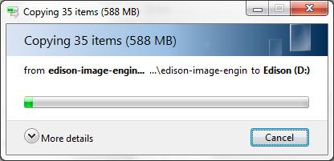
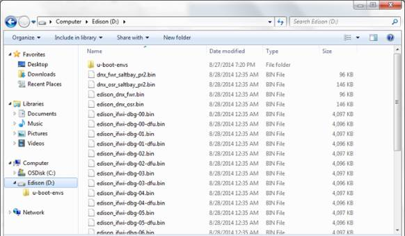

## Step 2: Copy over the latest image

Extract the contents of the [Yocto complete image](http://software.intel.com/iot/hardware/edison/downloads) zip, then copy the contents to your Intel® Edison drive.

---

1. Get the latest Yocto firmware image for the Intel® Edison.

    

    1. On the USB key: **downloads → Firmware - Edison Yocto**
    2. Copy **edison-image-[version].zip** to your computer.
    

      
    

    **Interested in finding out what's new with each firmware release?**
    
    Visit [Intel® Edison Boards and Compute Modules — Support Package Release Notes](http://www.intel.com/support/edison/sb/CS-035253.htm) to view the release notes PDF.
    

2. Extract the contents of **edison-image-[version].zip** to your hard drive.

3. Copy the **entire** contents of the **edison-image-[version]** folder to the "**Edison**" drive that shows up after plugging the Intel® Edison to your computer. 

    Do **not** include the containing/parent edison-image-[version] folder; just the contents of the folder.

    

Your "Edison" drive should now look similar to this:

