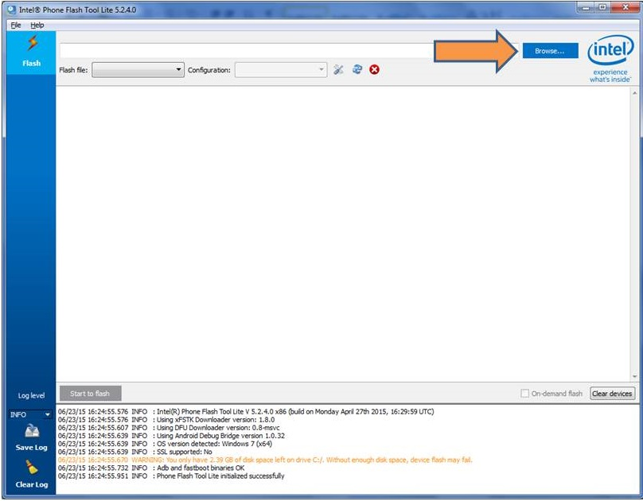
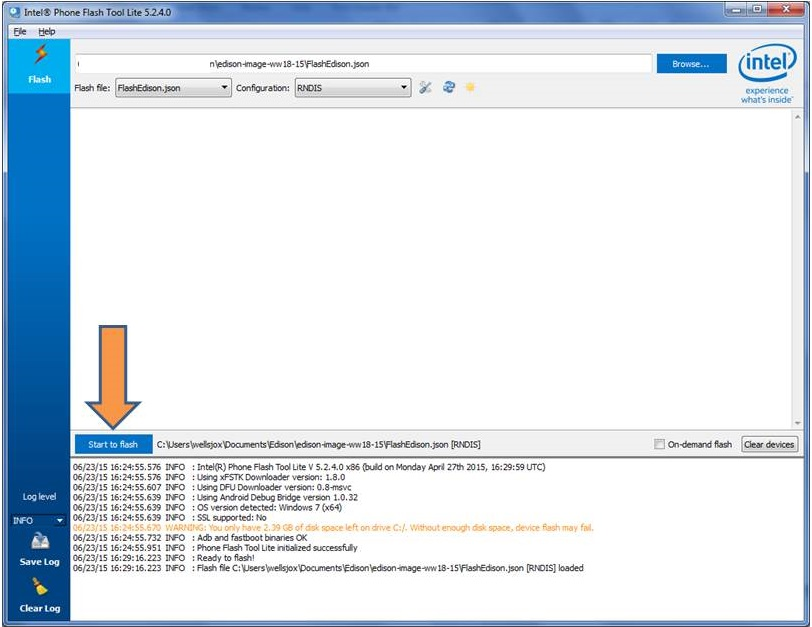

1. Unplug any USB or power cables connected to the Intel® Edison.

2. Get the latest Yocto firmware image for the Intel® Edison.

    

    1. On the USB key: downloads → Firmware
    2. Copy edison-image-[version].zip to your computer.
    

3. Launch the **Flash Tool Lite** program installed in the previous section.

4. Click **Browse** in the upper righthand corner. Select edison-image-[version].zip file.
 
    

    The tool extracts the zip file and loads FlashEdison.json.
 
    

5. For the "**Configuration**" drop down, if your host machine is:
    
    * **OS X or Linux:** choose "CDC" 
    * **Windows:** choose "RNDIS"

6. Unplug all cables from the Intel® Edison. 

7. Click **Start to Flash**.
 
    

8. When you see the prompt, plug a micro-USB cable into the **_top_** micro-USB connector on the expansion board.

    

    You should see the Flash Tool detect the board and begin the flash process.

    

9. Wait 3-4 minutes for the firmware progress to finish. Do **not** unplug the board during this time!

    
   

Once the flashing is completed, the board will restart and you will see a "Flash success" indicated in the Flash Tool.

