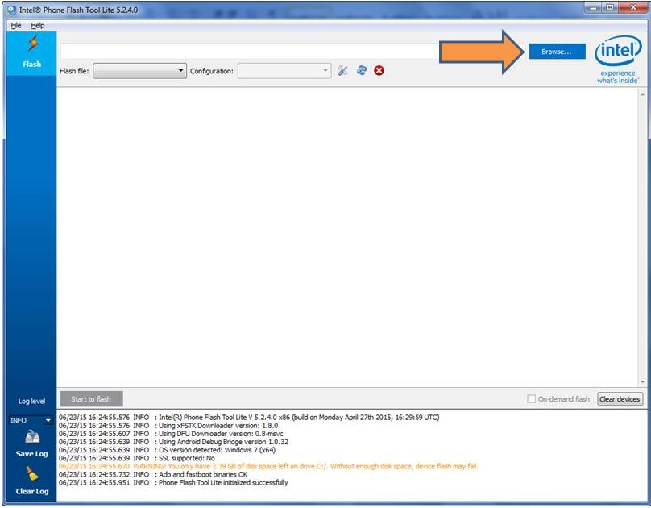
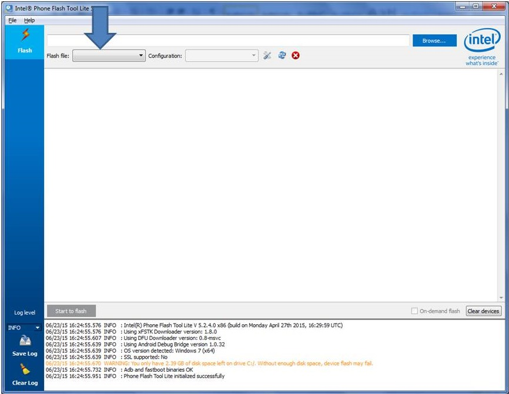
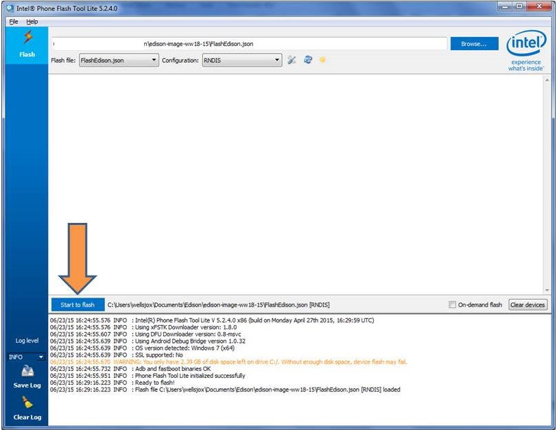
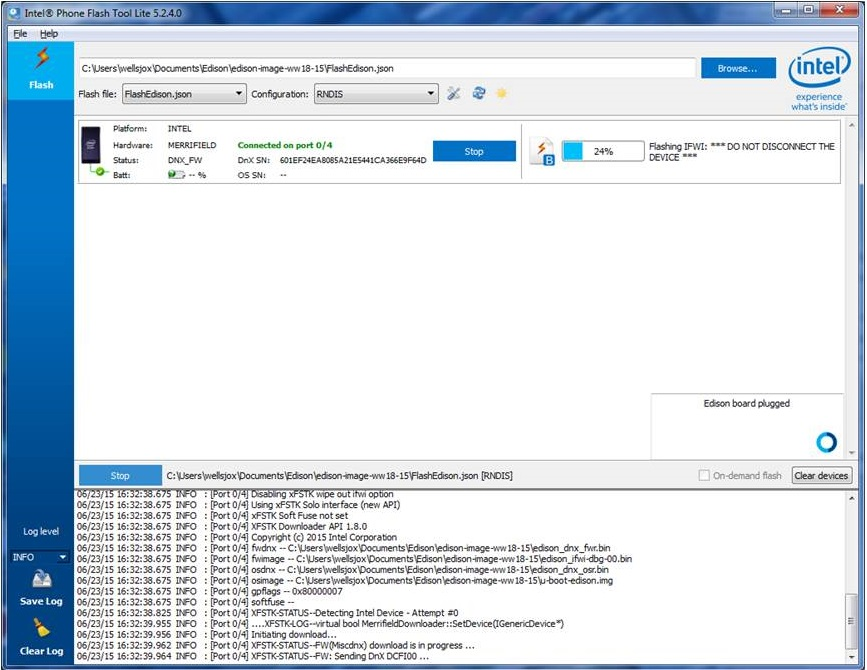
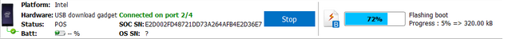

# Flash the Edison

1. Unplug any USB or power cables connected to the Intel® Edison.

2. Get the latest Yocto firmware image for the Intel® Edison.

    

    1. On the USB key: downloads → Firmware - Edison Yocto
    2. Copy edison-image-[version].zip to your computer.
    

3. Launch the **Flash Tool Lite** installed in the previous step.

4. Click browse and select edison-image-[version].zip file.
 
    

    The tool extracts the zip file and loads FlashEdison.json.
 
    

5. For the "Configuration" drop down, if your host machine is:
    
    * **OS X or Linux:** choose "CDC" 
    * **Windows:** choose "RNDIS".

6. Click **Start to Flash** (the Edison board is not plugged in yet).
 
    

6. Plug a micro-USB cable into the **_top_** micro-USB connector on the expansion board.

    

    You should see the Flash Tool detect the board and begin the flash process.

    

    **Firmware flash progress**

    
   
7. Once the flashing is completed, the board restarts. Do not unplug the board for at least 2-3 minutes.

### Next Steps

Gain command line access of your IoT board. Execute special Linux commands to configure your IoT board such as setting up Wi-Fi.

Please pick your operating system from the options below to proceed.

* [Windows »](../shell_access/windows/serial_connection.html)
* [Mac »](../shell_access/mac/serial_connection.html)
* [Linux »](../shell_access/linux/serial_connection.html)

