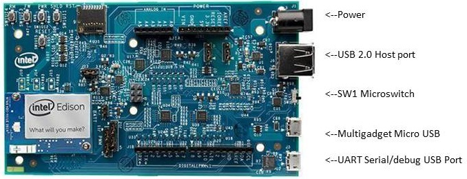

# Flash the Edison

To start this process, do not have the Edison board plugged in on USB or powered on with a power supply.

1. Get the latest Yocto firmware image for the Intel® Edison.

    

    1. On the USB key: **downloads → Firmware - Edison Yocto**
    2. Copy **edison-image-[version].zip** to your computer.
    

2. Launch Flash Tool Lite, click browse and select **edison-image-[version].zip** file.
 
   

3. The tool extracts the zip file and loads FlashEdison.json.
 
   

4. On the Configuration drop down, **choose CDC if your host machine is OS X or Linux**, **choose RNDIS for Windows**.

5. Click Start to Flash (the Edison board is not plugged in yet).
 
   

6. Plug the USB cable into the Multigadget port of the Edison board. You should see the Flash Tool detect the board and begin the flash process.

   

   **Firmware flash progress**

   
   
7. Once the flashing is completed, the board restarts do not unplug the board for atleast 2-3 minutes.

### Next Steps

You'll need to now gain command line access of your IoT board, in order to set up an internet connection. You'll also be executing special Linux commands to configure your IoT board such as setting up Wi-Fi.

Please pick your operating system from the options below to proceed.

* [Windows »](../shell_access/windows/serial_connection.html)
* [Mac »](../shell_access/mac/serial_connection.html)
* [Linux »](../shell_access/linux/serial_connection.html)

