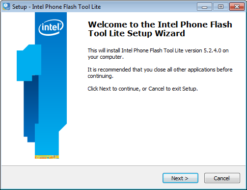
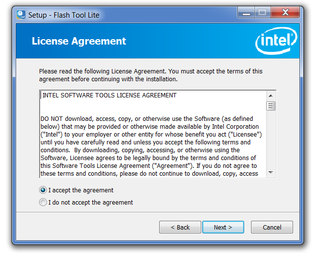
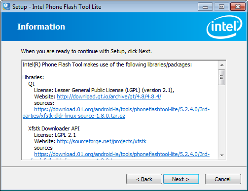
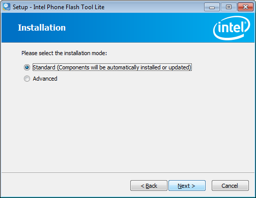
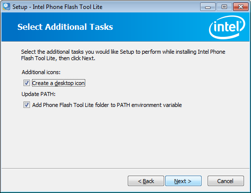
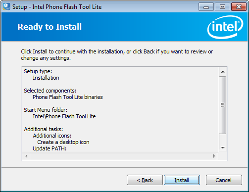
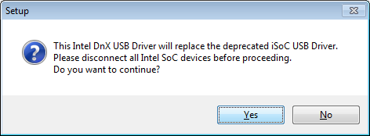

# Set up Flash Tool Lite for Windows*

This document explains the installation procedure Flash Tool Lite for Windows*. The tool is used to flash the firmware on Intel® Edison boards, but will expand to other IoT products in the future.

## Installation

1. Get the latest Flash Tool Lite.
   
   

   1. On the USB key: **downloads → Windows**
   2. Copy **PhoneFlashToolLite_[version]_win32.exe** to your computer.
   

2. Run the installer and click *Next*.
  
   

3. Accept the License agreement, click *Next*.

   
   
4. Click next after screen documenting libraries and packages.

   
   
5. Select *Standard* installation. 

   
   
6. Retain the selections, click *Next*.

   
   
7. Click *Install* to complete.

   
   
   *A driver install may be specified after completion of the main wizard, answer yes and complete that install.
   
   
   

### Next Steps

* [Update firmware using the tool »](update_firmware.html)

