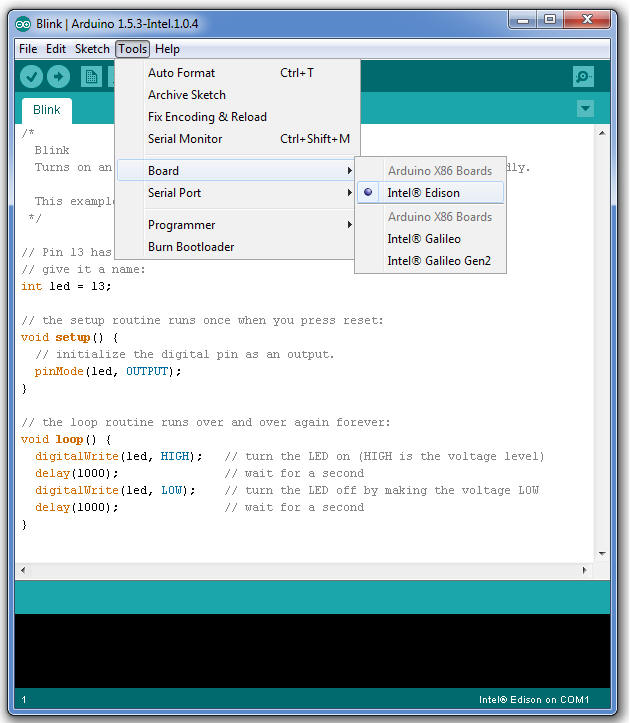

1. Choose **Tools** > **Board**, then select **Intel® Edison**.

    

2. Choose **Tools** > **Serial Port**, the select the serial device of your board. 

    The easiest way to find what port the board is using is by disconnecting your board, restarting the IDE, and re-opening the menu. The entry that disappears should be the Intel Edison board. Reconnect the board, restart the IDE, and select that serial port.

    More detailed instructions for your specific OS:
    * [Windows »](details-serial_port-windows.html)
    * [Mac OS X »](details-serial_port-mac.html)
    * [Linux »](details-serial_port-linux.html)