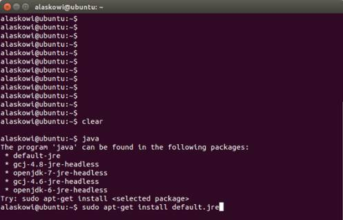
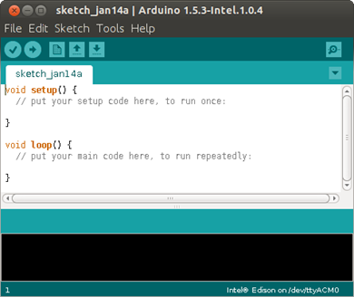
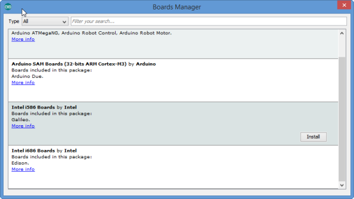

1. To check if you have Java installed, open a terminal and enter the command: `java`  
  
    

2. If you see the above message, you do not have Java installed and you will need to install it. To install the Java package, enter the command: `sudo apt-get install default.jre`  
  
    
 
    You may be prompted to enter your user password. 

3. Get the latest Arduino IDE.

    

    1. On the USB key: downloads → Linux
    2. Based on your Linux operating system (32 bit or 64 bit), copy arduino-[version]-linux32.tar.xz or arduino-[version]-linux64.tar.xzto your computer.
    

4. Navigate to the folder where you copied the Arduino IDE .txz file and double-click it to open the archive.  

    You can decompress the file from the command line. To do so, use xz by entering the following command: `unxz arduino-1.6.5-linux64.txz`

    If you don't have xz installed, install it by entering one of the following commands:
    * For Ubuntu or other Debian-based machines:  `sudo apt-get install xz-utils`
    * For Red Hat, Fedora, CentOS, or similar machines: `sudo yum install xz`

5. Click Extract and navigate to the directory where you would like to unzip the Arduino IDE. In this example, we will leave it in the Download directory. Click Extract.

6. The extracted folder should contain a file named arduino, as well as several folders. 
  
    

7. Open up a new Terminal window.

8. Navigate to the Arduino IDE folder. In in this example, the command will be `cd Downloads/arduino-x.x.x/`, where x.x.x is the Arduino IDE version number you downloaded.  Note: When you start typing in cd Downloads/arduino, you can press Tab to auto-complete the folder path.
  
    

9. To run Arduino with administrator privileges, enter the command: `sudo ./arduino`. If prompted, enter your password.
 
    
 
    The Arduino IDE opens.

10. In a serial communication window, check the availability of /ttyACM port by entering the following command: `ls /dev/ttyACM*`
 
    Note: If the /ttyACM* port is not available, here are several reasons why:
    
    * The modem manager is using the port. When the port becomes active, the modem manager can claim the port, blocking the IDE's access to the port. The exact command to remove it will depend on your Linux distribution. For example, the command `sudo apt-get remove modemmanager` may work.
    
    * The /ttyACM port was not created automatically when you plugged in your board. To add the port, do the following: 
      * Create a file: etc/udev/rules.d/50-arduino.rules
      * Add the following to the file: `KERNEL=="ttyACM[0-9]*", MODE="0666"`

11. Restart udev by entering the following command: `sudo service udev restart`
    If you are using a virtual machine (VM), you may need to reboot Linux within the VM.

12. Choose **Tools** > **Board** > **Boards Manager** to open the Boards Manager.
    
    

13. In the list of boards, select **Intel i686 Boards** which includes the Intel® Edison board.

14. Click **Install**.

15. When the installation process is finished, click **OK**.
