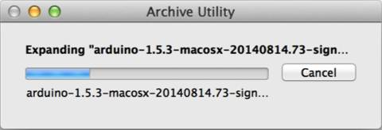
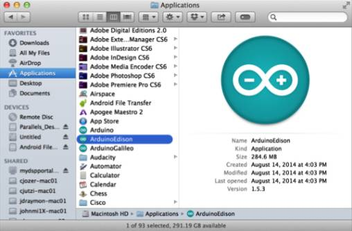

1. Get the latest Arduino IDE.

    

    1. On the USB key: downloads → Mac
    2. Copy arduino-[version]-macosx.zip to your computer.
    

2. Double-click arduino-[version]-macosx.zip to extract the archive. 
  
    

3. Rename Arduino to be ArduinoEdison.

4. Move ArduinoEdison into your Mac Applications folder. 
  
    

4. Double-click on ArduinoEdison to open the Arduino IDE.

6. To save on internet bandwidth, install the "Intel i686 Boards" toolchain manually to your Arduino IDE installation.

    

    1. On the USB key: downloads → Mac → edison_media
    2. Copy IntelArduinoToolChain_mac.zip to your computer and unzip it.
    3. Copy the uncompressed Intel folder and its contents to /Users/[YOUR_USER_NAME]/Library/Arduino15/packages on your computer.
    

7. Restart the Arduino IDE.

When you are using a more reliable internet connection, you can use the method below to update the Arduino boards list:

1. Choose **Tools** > **Board** > **Boards Manager** to open the Boards Manager.
  
    

2. In the list of boards, select **Intel i686 Boards** which includes the Intel® Edison board.

3. Click **Install**.

4. When the installation process is finished, click **OK**.

