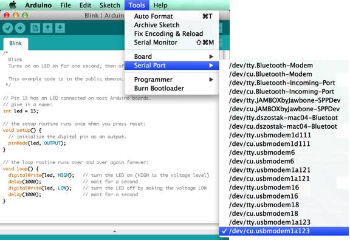

### Finding your port on a system with Mac OS X

1. Find the port for your board, which is likely to be **/dev/cu.usbmodemxxxx**. (Note "cu".)

    

2. Once you have selected your port, continue to upload the sketch to your board.
