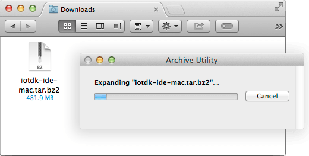

1. Get the latest IoT dev kit Eclipse IDE package.

    

    1. On the USB key: downloads → Mac → edison_media
    2. Copy iotdk-ide-mac.tar.bz2 to your computer.
    

2. Double-click iotdk-ide-mac.tar.bz2 to extract the contents of the archive.

    
