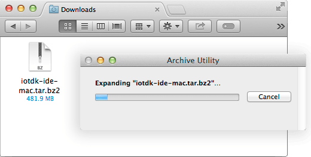

## Install Intel® IoT dev kit Eclipse IDE

Get the latest Eclipse IDE for Intel® IoT development. Download the compressed archive containing the customized IDE and extract the contents to your computer. 

<div class="callout danger" markdown="1">
**Important Note:** Windows users ***must*** use **7-zip** for extraction.
</div>

---

1. Get the latest IoT dev kit Eclipse IDE package.

    <div class="callout goto" markdown="1">
    1. On the USB key: **downloads → [your OS]**
    2. Copy the appropriate **iotdk-ide-[your OS]** file to your computer:
    </div>

---

Platform-specific instructions:

* [Windows »](#windows)
* [Mac »](#mac)
* [Linux »](#linux)


### Windows


1. Use 7zip to extract the archive: 

    <div class="callout danger" markdown="1">
    **Use 7Zip only. Do not use any other Windows file archiver utility.**

    7zip supports extended file paths which some of the contents of the compressed file have so only use 7zip software to extract the file. 
    </div>

    1. **Right-click** on **iotdk-ide-win.7z**.

    2. Select "**7zip**", then "**Extract here**". 

        

2. Wait for the extraction process to finish. It will take a a few minutes.


### Mac

1. Double-click **iotdk-ide-mac.tar.bz2** to extract the contents of the archive.

    


### Linux

1. Extract the contents of **iotdk-ide-linux.tar.bz2**.

    1. Open a new Terminal window.

    2. `cd` into the directory that contains the .bz2. e.g. If you copied the file to your desktop: 

        ```
        cd ~/Desktop/
        ```

    3. Extract the tar.bz2. The process will take a a few minutes. 

        ```
        tar -jxvf iotdk-ide-linux.tar.bz2
        ```
