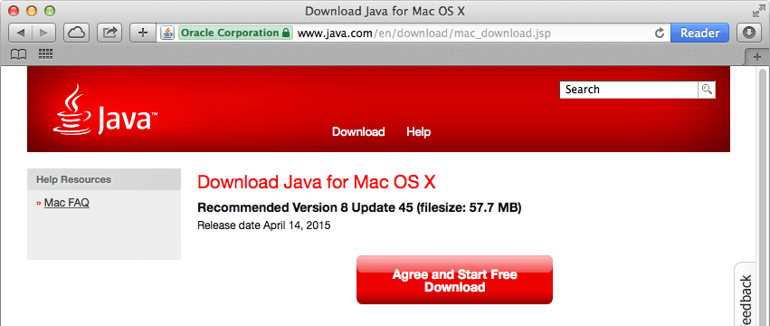

A Java runtime ships with the Mac operating system however, if you are running OS X 10.9.4 or older, you may need to update your version of Java.

1. If you do not have Java installed, download the Oracle distribution of Java for Mac from [java.com/en/download/mac_download.jsp](https://www.java.com/en/download/mac_download.jsp).

    
