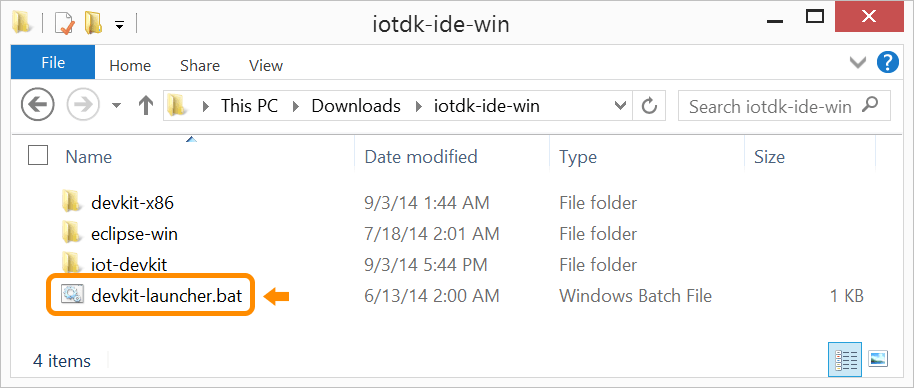

1. Once the archive file is extracted, go into the resulting iotdk-ide directory.

2. Double-click on devkit-launcher to launch the IoT dev kit Eclipse IDE.

    On Windows, you may need to right-click on devkit-launcher.bat and select "**Run as administrator**".

    

You should see a command line window appear (and quickly disappear, if you are on Windows) and the Eclipse IDE will launch using the iot-devkit workspace and display a welcome screen. 

