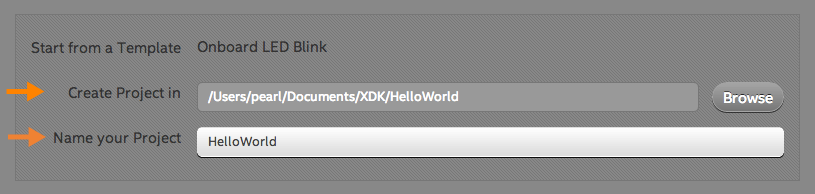
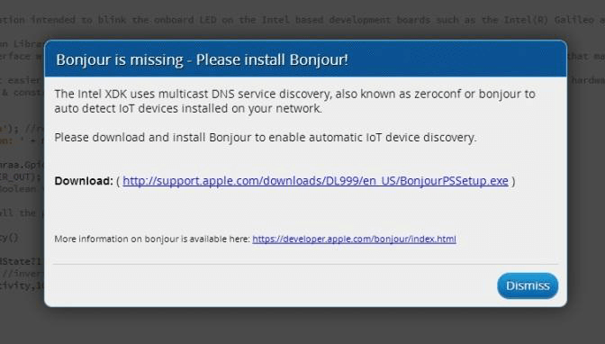

1. Under the "**Internet of Things (IoT) with Node.js Projects**" option in the lefthand menu, select "**Start with a Sample or Template**".

    

2. A list of templates for developing Node.js applications will be shown. 

    Select "**Onboard LED Blink**" template.

    
    
3. Then click "**Use This Template"**.

    

4. Choose a directory for your project files, and enter a name for your project.

    

5. Click "**Create**" in the bottom right corner.

    

**Missing Bonjour?**

If Bonjour is not installed on your machine, you will see a "Bonjour is missing" message.

**Windows users:** Complete the steps in [Install Bonjour](details-install_bonjour.html).

