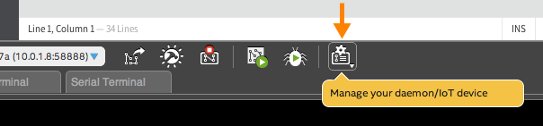
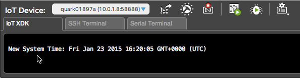

1. In the bottom toolbar, click the "**Manage your daemon/IoT device**"** icon**.

    

2. Select "**sync PC time w/ clock on target device**".

    

A message in the console log will appear to confirm the update.

