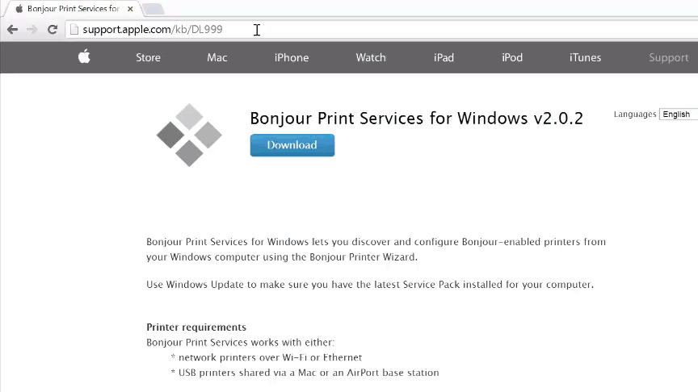

# Set Up Intel® XDK IoT Edition - Part 1: Installation

The [Intel® XDK IoT Edition](https://software.intel.com/en-us/html5/xdk-iot) lets you create and test applications on Intel® IoT platforms. It uses NodeJS to communicate with all the GPIOs, libraries, and packages. The IoT edition also provides NodeJS templates for creating new applications that interact with sensors and actuators, enabling you to get a quick start on developing for the Internet of Things. 

This document will guide you through installing the Intel® XDK IoT Edition IDE on either the Intel® Galileo or the Intel® Edison.

<div id="toc" class="box" markdown="1">
* [Install Intel® XDK IoT Edition »](#install-intel-xdk-iot-edition)
  * [Windows only: Install Bonjour »](#windows-only-install-bonjour)
* [Launch and sign into Intel® XDK »](#launch-and-sign-into-intel-xdk)
</div>

<!-- <div id="related-videos" class="callout video">
[Setting Up The Intel XDK IoT Edition Part 1: Installation](https://software.intel.com/en-us/videos/setting-up-the-intel-xdk-iot-edition-part-1-installation)
</div> -->

## Install Intel® XDK IoT Edition

<div class="tldr" markdown="1">
Get the latest Intel® XDK IoT Edition installer for your computer's OS. Simply run the installer and follow the prompts.

[View detailed instructions »](details-install_xdk.html)
</div>

## Step 1: Install Intel® XDK IoT Edition

1. Get the latest Intel® XDK IoT Edition installer.

 <div class="callout goto" markdown="1">
 1.  On the USB key: **downloads → [your OS]**.
 2.  Copy the appropriate **iot_web_[your OS]\_master\_[version]** installer file to your computer:
 </div>

### On Windows

2. Double-click on **iot_web_win_master_[version].exe** to start the installer. 

### On Mac

2. Double-click on **iot_web_mac_master_[version].dmg** to open the Apple Disk Image.

3. Double-click on the extracted **xdk_full_[version].pkg** to start the installer.

### On Linux

2. Open Terminal.

3. Use the `cd` command to go into the folder where the installer file is. For example:

 ```
 cd ~/Desktop/
 ```

4. Use the `tar` command to extract the .tgz. For example:

 ```
 tar zxvf iot_web_linux64_master_1912.tgz
 ```

 (Note: Replace the filename shown below with your .tgz filename.)

5. Go into the extracted folder, then run the installer shell file. For example:

 ```
 cd iot_web_linux64
 ./install.sh
 ```

### All platforms

After launching the Intel® XDK installer, follow the installation wizard and click "Next" where needed.


### Windows only: Install Bonjour

<div class="tldr" markdown="1">
[Bonjour](http://support.apple.com/kb/DL999) (or zeroconf) is a service that enables the Intel® XDK to auto detect Intel® IoT devices on your network. This service is already available on Mac and Linux; only Windows users need to install an additional Bonjour service. 

[View detailed instructions »](details-install_bonjour.html)
</div>

[](details-install_bonjour.html)


## Launch and sign into Intel® XDK

<div class="tldr" markdown="1">
Before you can use the Intel® XDK, you must sign up for an Intel® XDK account or log in to a pre-existing account. 

[View detailed instructions »](details-launch_xdk.html)
</div>

[](details-launch_xdk.html)


<div id="next-steps" class="note" markdown="1">
### Next Steps

Create and run a Hello Word project (blinking the onboard LED) on either the Intel® Galileo or the Intel® Edison.

* [Run a Sample Intel XDK for IoT Project »](create_project.html)
</div>
