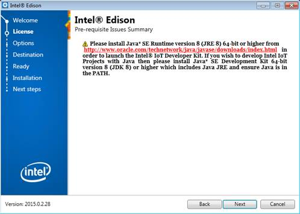
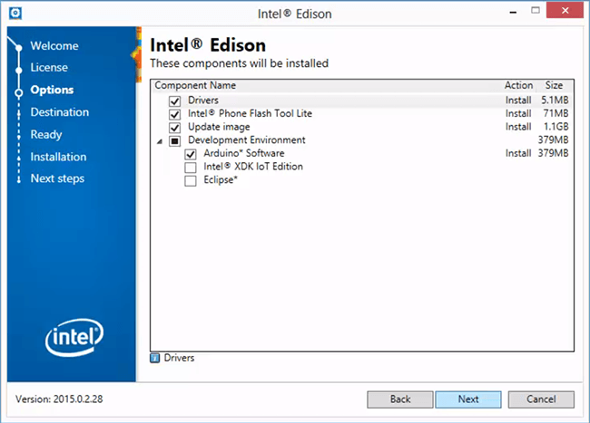
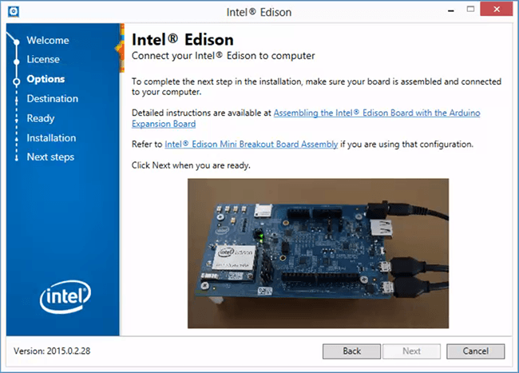
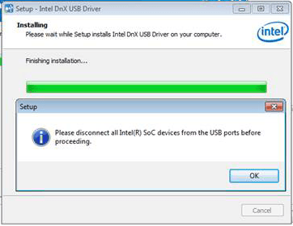

1. Get the latest Intel® IoT DevKit offline installer.

    

    1. On the USB key: downloads
    2. Copy the entire Windows folder to your computer
    

2. When the file transfer is complete, go into the Windows folder you copied to your development machine.

3. Double-click install.bat to start installer.

    NOTE: Installation requires administrative rights. If you get a “Do you want to allow following program to make changes to this computer” dialog, click **Yes**.

    

4. Follow the installation wizard prompts. Click **Next** where needed.

5. If you do not have the required Java version installed, you will see a message. 

    
  
    If you see a message, visit [oracle.com](www.oracle.com/technetwork/java/javase/downloads/index.html) to download _Java Platform (JDK) 8u65 / 8u66_ or higher.

    Install Java, then click **Next** in the Intel® IoT DevKit offline installer to continue.

6. When you reach the components option screen, leave the first three options ***selected***:
    * **Drivers** -- installs the Intel® Edison drivers and FTDI serial drivers for Windows,
    * **Intel® Phone Flash Tool Lite** -- installs tool to flash Intel® Edison firmware
    * **Update image** -- flashes the latest firmware image directly on your Intel® Edison 

    Under "**Development Environment**", ***select one or more*** of the IDEs to install: 

    * **Arduino™ Software** -- for simplified C++ development 
    * **Intel® XDK IoT Edition** -- for JavaScript / NodeJS development
    * **Eclipse™** -- for C/C++ development

    **WARNING: If you have a previous version of an IDE installed, it will be replaced.**

    Click **Next**.

    

7. Since you will be updating the firmware, connect the device mode and UART/serial cables to your computer, along with powering the board using DC power. 

    

    Click **Next** when ready. 

    If the Next button is greyed out, wait one minute for the Intel® Edison to finish booting up.

8. Follow the instructions on the screens and click **Install** or **Next** when prompted to continue with the installation wizard. 

    

    If prompted to disconnect all SoC devices, click **OK** to let installation continue.

9. The entire installation and flashing process may take up to 30 minutes. When done, click **Finish** to close the installation wizard.

    
