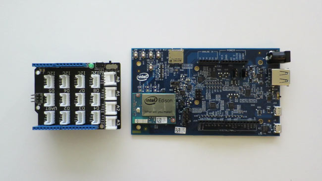
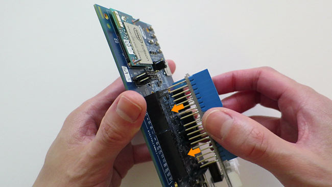
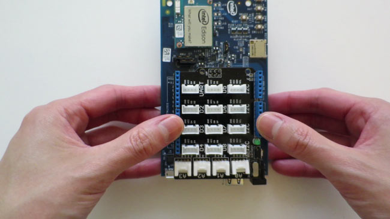
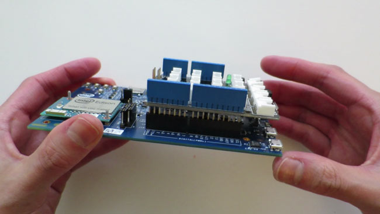
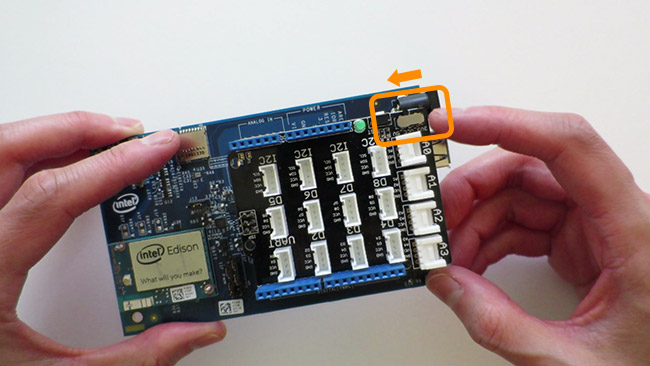

1. Unplug the Arduino expansion board from all power sources.

    

2. Line up the male header pins of the Grove Base Shield with the female pins on the Arduino expansion board. 

    Pin configurations of Arduino shields will only fit the Arduino expansion board in one direction so do not force the pins if they do not line up.

    

3. Push down firmly and evenly on both sides of the Grove Base Shield until the shield is securely installed.

    

    

4. Check the voltage toggle (marked VCC, next to A0) on the Grove Base Shield. It should be set to 5V. 

    

5. Power the expansion board back on. Allow 1 minute for your Intel® Edison to finish booting up.

If correctly installed, the green LED on the Grove Base Shield will light up.

