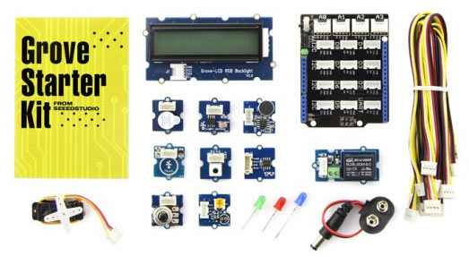

<!--  -->

### Located in the cardboard box

* [Base Shield v2](http://www.seeedstudio.com/depot/Base-Shield-V2-p-1378.html)
* [Grove LCD RGB Backlight](http://www.seeedstudio.com/depot/Grove-LCD-RGB-Backlight-p-1643.html)
* [Grove Buzzer](http://www.seeedstudio.com/depot/Grove-Buzzer-p-768.html)
* [Grove Sound Sensor](http://www.seeedstudio.com/depot/Grove-Sound-Sensor-p-752.html)
* [Grove Touch Sensor](http://www.seeedstudio.com/depot/Grove-Touch-Sensor-p-747.html)
* [Grove Temperature](http://www.seeedstudio.com/depot/Grove-Temperature-Sensor-p-774.html)
* [Grove Light Sensor](http://www.seeedstudio.com/depot/Grove-Light-Sensor-p-746.html)
* [Grove Rotary Angle Sensor](http://www.seeedstudio.com/depot/Grove-Rotary-Angle-Sensor-p-770.html)
* [Grove Button](http://www.seeedstudio.com/depot/Grove-Button-p-766.html)
* [Grove LED Socket with 3mm Red LED](http://www.seeedstudio.com/depot/Grove-Red-LED-p-1142.html)
* [Grove LED Socket with 3mm Green LED](http://www.seeedstudio.com/depot/Grove-Green-LED-p-1144.html?cPath=81_35)
* [Grove LED Socket with 3mm Blue LED](http://www.seeedstudio.com/depot/Grove-Blue-LED-p-1139.html)
* [Grove 3-Axis Digital Accelerometer(±1.5g)](http://www.seeedstudio.com/depot/Grove-3Axis-Digital-Accelerometer15g-p-765.html?cPath=25_132)
* [Grove Piezo Vibration Sensor](http://www.seeedstudio.com/depot/Grove-Piezo-Vibration-Sensor-p-1411.html)
* micro-USB cable

### Extra materials

In addition, you may have also received these parts:

* 28BYJ48 Stepper Motor
* Seeed Stepper Motor Driver
* 12V AC Power Adapter
* second micro-USB cable
