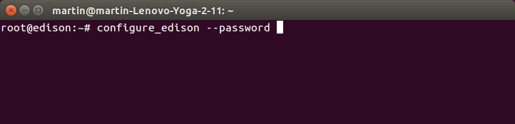

* [Install a shell session manager (Screen) »](#install-a-shell-session-manager-screen)
* [Establish a serial connection »](#establish-a-serial-connection)
* [Configure a password to enable SSH](#configure-a-password-to-enable-ssh)

# Shell Access - Linux

If you need to configure your IoT board, you will need to remotely connect to the Intel® Edison or Intel® Galileo. Once connected to your Intel® IoT board, you have access to the Linux-based Yocto operating system running on the board. 

You can then execute special Linux commands such: changing the hostname and password, setting up Wi-Fi, or flashing new firmware.

## Install a shell session manager (Screen)

Your computer may not have come with a pre-installed shell session manager. Download and install the GNU Screen utility using `sudo apt-get install screen`. 

[View detailed instructions »](details-install_screen.html){: .link-button .centered}

## Establish a serial connection

Use the Screen utility that you installed in the previous section to gain command line access of your IoT board. For example: `sudo screen /dev/ttyUSB0 115200`.

[View detailed instructions »](details-screen_connection.html){: .link-button .centered}

## Configure a password to enable SSH 

You must enable SSH in order to work with the Intel® XDK and Eclipse over Wi-Fi. Setting a password on your Intel® Edison by running `configure_edison --password` will enable SSH.

[View detailed instructions »](details-configure_password.html){: .link-button .centered}

You are now logged into your IoT board and can run shell commands.

[Continue to the next step in the START HERE guide »](../../index.html#done-shell-access){: .link-button .centered}

