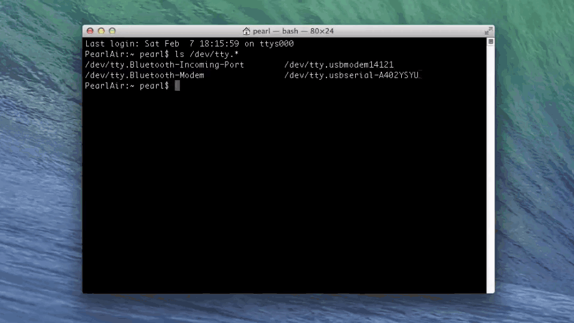

<div id="toc" markdown="1">
* [Identify the "usbserial" device name »](#identify-the-usbserial-device-name)
* [Establish a serial connection »](#establish-a-serial-connection)
</div>

# Shell Access - Mac 


If you need to configure your IoT board, you will need to remotely connect to the Intel® Edison or Intel® Galileo. Once connected to your Intel® IoT board, you have access to the Linux-based Yocto operating system running on the board. 

You can then execute special Linux commands such: changing the hostname and password, setting up Wi-Fi, or flashing new firmware.

<!-- <div id="related-videos" class="callout video">
[Shell Access – Mac](https://software.intel.com/en-us/videos/shell-access-mac)
</div> -->

## Identify the "usbserial" device name 

<div class="tldr" markdown="1">
Use the `ls /dev/tty.*` command in Terminal to find the device name of the "**usbserial**" connection. You will need the exact device name for use in [Establish a serial connection](#establish-a-serial-connection) next. 

[View detailed instructions »](details-identify_usbserial.html)
</div>

[](details-identify_usbserial.html)


## Establish a serial connection

<div class="tldr" markdown="1">
Use the Screen utility in Terminal to gain command line access of your IoT board. For example: `screen /dev/tty.usbserial-A102GW3T 115200`. 

[View detailed instructions »](details-screen_connection.html)
</div>

[](details-screen_connection.html)


<div class="callout done" markdown="1">
You are now logged into your IoT board and can run shell commands. For example, to output the version number of the firmware running on your board:

```
cat /etc/version
```


The firmware version is in YYYYMMDDHHMM format so, in this case, Sept 3, 2014.
</div>

<div class="callout goto" markdown="1">
For more info on using Screen such as quitting, read [Using Screen »](../mac-and-linux/using_screen.html)
</div>


<div id="next-steps" class="note" markdown="1">
### Next Steps

Get your board online in order to turn your IoT board into a true "Internet of Things" device. You also need the IP address of your IoT board to program it using the dev kit IDEs.

* [Get Your Edison Board Online »](../../connectivity/wifi/connect.html)
</div>