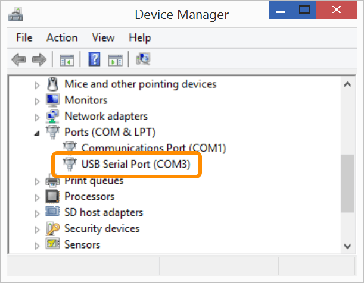

1. Connect a micro-USB cable to the **UART/serial** micro-USB port of the Intel® Edison expansion board, and the other end to your computer.

    
  
    Refer to [UART/serial micro-USB cable](../../assembly/arduino_expansion_board/details-serial_cable.html) for more detailed cable connection information.

2. Open **Device Manager**.

    _Don't know how? Refer to [Confirm Drivers → Open Device Manager](../../computer_setup/windows/index-confirm_drivers.html#open-windows-device-manager)._

3. Scroll down to the "**Ports (COM & LPT)**" section.

4. **Make a note of your COM #** for the "**USB Serial Port**" device. 

    Do ***not*** use the COM number for "Intel Edison USB Composite Device" or "Intel Edison Virtual Com Port". Those are for other features.

    

    Use the COM # shown on ***your*** computer's Device Manager. In the screenshot, it is "COM3" but your computer will have unique COM port number assignments and may be different from the screenshot.

**Don't see a "USB Serial Port" device listed?**

* **Do you have the serial drivers installed?**
  * A serial connection cannot be detected without FTDI serial drivers. Refer to [Set Up Your Computer - Windows (manual installation)](../../computer_setup/windows/index.html#install-ftdi-serial-drivers).

* **Do you have the UART/serial cable connected?** Refer to [UART/serial micro-USB cable](../../assembly/arduino_expansion_board/details-serial_cable.html).

* Is your IoT board powered on?

