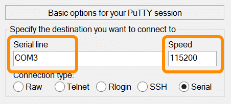

1. In PuTTY, double-check that you are in the "Session" screen. 

    

2. Select the "**Serial**" radio button under "Connection type".

    

3. Specify the destination you want to connect to:

    * **Serial Line**: use the **COM #** (e.g. "COM3") noted in [Identify the serial COM port](details-identify_com_port.html)
    * **Speed**: use "115200" for the baud rate
    
    

4. Click "**Open**" to connect to the board.

    

5. When you see a blank screen, **press the Enter key**.
 
    **For Intel® Edison boards running older firmware**: You may need to press the Enter key **twice**.

    

6. Once connected you will see a login prompt. 

    Type in "**root**" for the username and press **Enter**.

    

For more info on using PuTTY such as saving profiles, read [Using PuTTY »](using_putty.html)

