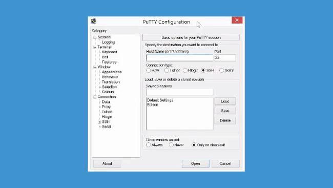

<div id="toc" markdown="1">
* [Download a terminal client (PuTTY) »](#download-a-terminal-client-putty)
* [Identify the serial COM port »](#identify-the-serial-com-port)
* [Establish a serial connection »](#establish-a-serial-connection)
</div>

# Shell Access - Windows


If you need to configure your IoT board, you will need to remotely connect to the Intel® Edison or Intel® Galileo. Once connected to your Intel® IoT board, you have access to the Linux-based Yocto operating system running on the board. 

You can then execute special Linux commands such: changing the hostname and password, setting up Wi-Fi, or flashing new firmware.

<!-- <div id="related-videos" class="callout video">
[Shell Access – Windows](https://software.intel.com/en-us/videos/shell-access-windows)
</div> -->

## Download a terminal client (PuTTY)

<div class="tldr" markdown="1">
Windows does not come with a built-in terminal emulator so download and use the [PuTTY](http://www.putty.org/) client. 

[View detailed instructions »](details-putty.html)
</div>

[](details-putty.html)


## Identify the serial COM port

<div class="tldr" markdown="1">
Use Device Manager to find the COM port number for the "**USB Serial Port**" connection. You will need the COM # to configure PuTTY in Establish a serial connection. 

[View detailed instructions »](details-identify_com_port.html)
</div>

[](details-identify_com_port.html)


## Establish a serial connection

<div class="tldr" markdown="1">
Use PuTTY to establish a **serial** connection to the IoT board using the COM # you noted in the previous [Identify the serial COM port](#identify-the-serial-com-port) section and the baud rate **115200**. 

[View detailed instructions »](details-putty_serial_connection.html)
</div>

[](details-putty_serial_connection.html)

<div class="callout done" markdown="1">
You are now logged into your IoT board and can run shell commands. For example, to output the version number of the firmware running on your board:

```
cat /etc/version
```


The firmware version is in YYYYMMDDHHMM format so, in this case, Sept 3, 2014.
</div>

<div class="callout goto" markdown="1">
**Additional resources**

For more info on using PuTTY such as saving profiles, read [Using PuTTY »](using_putty.html)
</div>

<div id="next-steps" class="note" markdown="1">
### Next Steps

Get your board online in order to turn your IoT board into a true "Internet of Things" device. You also need the IP address of your IoT board to program it using the dev kit IDEs.

**At a hackathon? On a busy or restricted Wi-Fi network?**

Connect to the Intel® Edison using the device mode micro-USB cable and a virtual Ethernet connection known as "Ethernet over USB":

* [Windows »](../../connectivity/ethernet_over_usb/windows/connect.html)

**At home? Have a dependable Wi-Fi connection?**

* [Get Your Edison Board Online »](../../connectivity/wifi/connect.html)
</div>